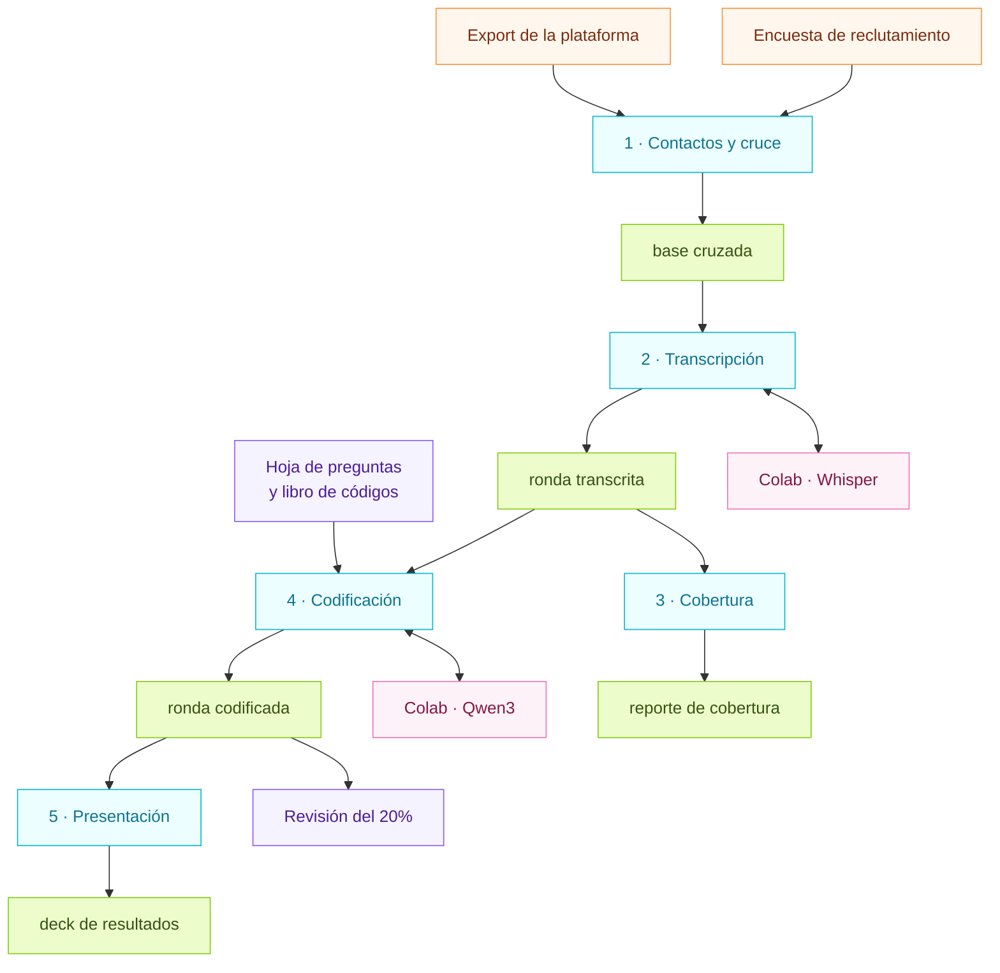
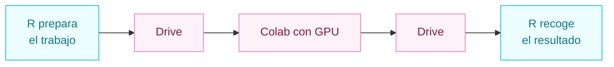

# Panel de encuestas por WhatsApp — CISCo / IJD, UdelaR

Este repositorio procesa las **rondas** de un panel de encuestas: un mismo grupo de
personas al que se vuelve a consultar periódicamente, para poder comparar sus respuestas
a lo largo del tiempo en vez de mirar una foto puntual.

Cada ronda se envía por WhatsApp, admite respuestas **por texto y por audio**, y combina
preguntas cerradas con preguntas abiertas. De ahí los dos pasos que no existen en una
encuesta tradicional: **transcribir** los audios y **codificar** las respuestas abiertas
contra un codebook.

El resultado de cada ronda es una base limpia y comparable con las anteriores, y una
presentación de resultados.

> Este README es el panorama general. El detalle de criterios y convenciones de cada paso
> está en [DOCUMENTACION.md](DOCUMENTACION.md).

## El flujo



## Paso a paso

Todo se corre desde la raíz del proyecto. Antes de empezar una ronda nueva, actualizar el
bloque `ronda:` de `project.yml`: con eso se reacomodan todas las rutas.

| | Qué hace | Cómo se corre |
|---|---|---|
| **1** | Cruza el export de la plataforma con los demográficos de la encuesta de reclutamiento | `Rscript code/contacts_lime.R`<br/>`Rscript code/matching.R` |
| **2** | Baja los audios, los manda a transcribir y reinserta el texto | `quarto render code/transcripciones.qmd`<br/>+ `whisper_colab.ipynb` en Colab |
| **3** | Reporte de cuánta gente respondió, completitud, texto vs audio | `quarto render code/reporte_panel.qmd` |
| **4** | Codifica las respuestas abiertas contra el libro de códigos | `Rscript DriveFlow/exportar_para_colab.R`<br/>+ `codificacion_colab.ipynb` en Colab<br/>`Rscript DriveFlow/importar_de_colab.R` |
| **5** | Arma la presentación de resultados de la ronda | `Rscript code/presentacion/armar_presentacion.R` |

Los pasos 2 y 4 tienen la misma forma: **R deja el trabajo en una carpeta de Drive, un
notebook de Colab lo procesa con GPU y devuelve el resultado a la misma carpeta.** Los dos
notebooks se corren por bloques y son reanudables: si se corta la sesión, se vuelven a
ejecutar y siguen con lo que falta.



Después del paso 4 hay un paso humano que no se automatiza: **revisar a mano la muestra
del 20%** que queda en Drive y correr `medir_acuerdo()` para saber si el codebook y el
modelo están funcionando.

## Estructura de carpetas

```
project.yml                  configuración del proyecto y de la ronda vigente
DriveFlow/<ronda>.yml        configuración de codificación de esa ronda

code/                        todo el código de R
  contacts_lime.R            paso 1
  matching.R                 paso 1
  transcripciones.qmd        paso 2
  whisper_colab.ipynb        paso 2, se sube a Colab
  analisis_panel.R           paso 3, funciones
  reporte_panel.qmd          paso 3, reporte HTML
  codificacion_colab.ipynb   paso 4, se sube a Colab
  presentacion/              paso 5

DriveFlow/                   codificación con modelo de lenguaje
  qualcode.R                 funciones
  exportar_para_colab.R      manda el trabajo a Drive
  importar_de_colab.R        trae los códigos y los pega a la ronda
  run.R                      alternativa: codificar en la propia máquina

data/
  raw/                       datos como llegan, nunca se editan a mano
    limesurvey/              encuesta de reclutamiento
    campaigns_wcx/           export de la plataforma, por ronda
    contacts/                contactos con demográficos
    codebook/                copia local de la hoja de preguntas y el libro de códigos
    transcriptions/          audios bajados y textos transcritos, por ronda
    acumulada/rounds/        cada ronda ya transcrita
  processed/                 datos derivados, se regeneran corriendo el flujo
    matched/                 base cruzada
    transcriptions/output/   ronda transcrita
    analysis/<año>/<ronda>/  tablas, ronda codificada, QA e insumos congelados

assets/                      logos institucionales y plantilla del deck
presentaciones/              presentaciones generadas, una por ronda
plots/<año>/<ronda>/         gráficos sueltos del análisis
```

La regla: **lo que está en `raw/` no se toca; lo que está en `processed/` se puede borrar
y volver a generar.** Los audios `.ogg` no se versionan porque se vuelven a descargar de
los enlaces del export; los `.txt` de las transcripciones sí, porque no se regeneran sin
GPU.

## En Drive

El equipo trabaja sobre una carpeta compartida, sin pasar por GitHub:

```
Análisis/
  A/<ronda>            audios .ogg a transcribir
  B/<ronda>            .txt que devuelve el Colab
  C/<ronda>            intercambio de la codificación
  LibroCodigos         libro de códigos, una hoja por ronda
  Presentaciones/      decks de cada ronda
  whisper_colab.ipynb
  codificacion_colab.ipynb
```

Las carpetas se referencian por **ID** en `project.yml`, no por nombre: la carpeta del
equipo es compartida y ahí las rutas por nombre no resuelven.

## Requisitos

- **R** con `tidyverse`, `yaml`, `glue`, `readxl`, `writexl`, `googledrive`,
  `googlesheets4`, `ellmer`, `officer`, `knitr`.
- **Quarto**, para los reportes y los `.qmd`.
- **Cuenta de Google** con acceso a la carpeta del equipo, y un acceso directo a la
  carpeta `Análisis` en Mi unidad para que Colab la vea.
- **Colab con GPU** para transcribir y codificar.

Conviene tener **R actualizado**: varias dependencias del flujo dejaron de tener binarios
para versiones viejas.
