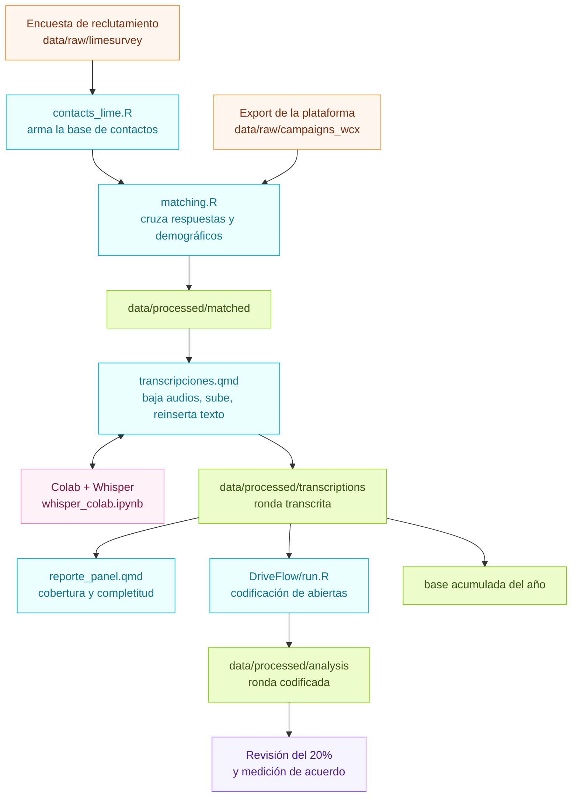
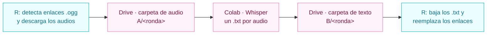
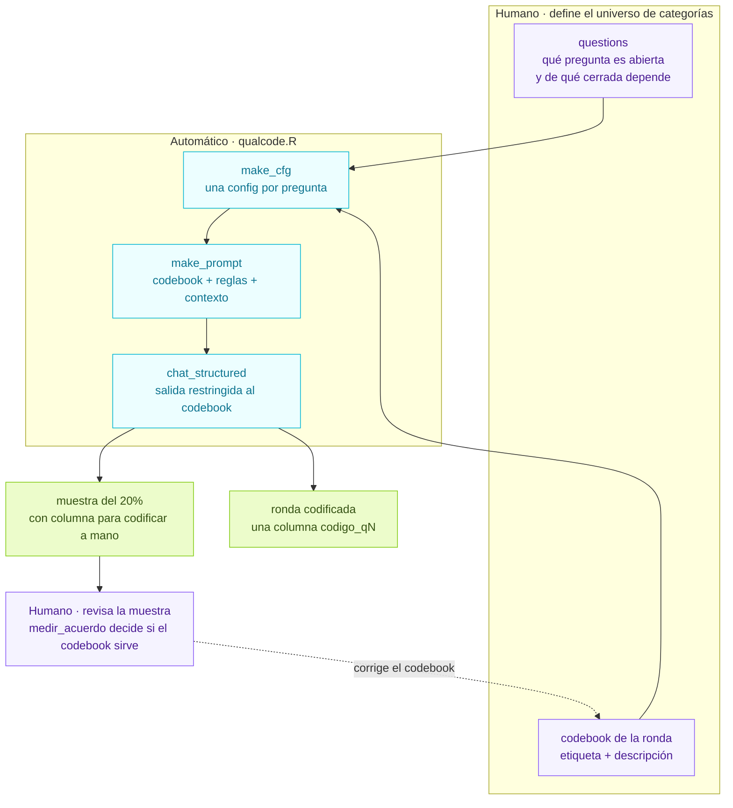

# Panel de encuestas por WhatsApp - CISCO/ IJD, UDELAR

Este repositorio procesa las **rondas** de un panel de encuestas: un mismo grupo de
personas al que se vuelve a consultar periódicamente para poder comparar sus respuestas
a lo largo del tiempo, en vez de mirar una foto puntual.

Las consultas se envían por una plataforma de mensajería que admite respuestas **por
texto y por audio**, y combinan **preguntas cerradas** (escalas, opción múltiple) con
**preguntas abiertas** ("¿por qué?", "¿qué opina de…?"). Eso impone dos pasos que no
existen en una encuesta tradicional:

- **transcribir** los audios antes de poder analizar cualquier cosa;
- **codificar** las respuestas abiertas contra un codebook para poder tabularlas.

El resultado de cada ronda es una base limpia, con demográficos, transcripciones y
respuestas abiertas codificadas, comparable con las rondas anteriores.

## Flujo



## Pasos

### 1. Contactos y cruce

El export de la plataforma solo trae el teléfono como identificador. Para poder analizar
por segmento y seguir a la misma persona entre rondas, hay que cruzarlo con los
demográficos, que vienen de la encuesta de reclutamiento del panel.

| | |
|---|---|
| **Scripts** | `code/contacts_lime.R` → `code/matching.R` |
| **Entrada** | export de la ronda en `data/raw/campaigns_wcx/`, encuesta de base en `data/raw/limesurvey/` |
| **Salida** | `data/raw/contacts/<AAAAMMDD>.csv` y `data/processed/matched/<campaign>.csv` |

Criterios del cruce:

- la clave son los **últimos 8 dígitos del teléfono**, para no depender del formato del prefijo;
- se usa `left_join` desde la encuesta: quien todavía no está en la base de reclutamiento
  **no se descarta**, queda con `match_lime = 0`;
- una persona puede tener **varios envíos** en una misma ronda: se conserva el más completo;
- se conservan las respuestas parciales, con `n_resp` y `completa` como columnas.

### 2. Transcripción de los audios

Las respuestas de audio llegan como enlaces `.ogg` dentro de las celdas. El notebook de
Quarto detecta esas celdas, descarga los audios, los sube a Drive, espera a que el Colab
los transcriba y reemplaza cada enlace por su texto.

| | |
|---|---|
| **Scripts** | `code/transcripciones.qmd` + `code/whisper_colab.ipynb` |
| **Entrada** | `data/processed/matched/<campaign>.csv` |
| **Salida** | `data/processed/transcriptions/output/<año>/transcripcion_<ronda>.csv` y `.xlsx` |



El circuito depende de una sola convención: **cada `.txt` conserva el nombre del `.ogg`**
(`q3_fila57.ogg` → `q3_fila57.txt`). De ese nombre sale la fila y la columna a la que
vuelve el texto, así que no hay que renombrar nada en el medio.

`transcripciones.qmd` se corre **bloque por bloque**, porque en el medio hay que ir a
ejecutar el Colab. Tiene un modo prueba (`PRUEBA` / `N_PRUEBA`) para validar el circuito
completo con unos pocos audios antes de procesar la ronda entera.

### 3. Cobertura de la ronda

Antes de analizar contenido conviene saber cuánta gente respondió, quién completó y en
qué formato. Es también el control de calidad del envío.

| | |
|---|---|
| **Scripts** | `code/analisis_panel.R` (funciones) y `code/reporte_panel.qmd` (reporte HTML) |
| **Entrada** | el export crudo de la ronda |
| **Salida** | tablas en `data/processed/analysis/<año>/<ronda>/` |

Da respuestas totales, tasa de respuesta y de completitud por persona, reparto entre
texto y audio, embudo de abandono pregunta a pregunta y evolución por día.

Reglas de conteo, editables en `PARAMS` arriba de `code/analisis_panel.R`:

| Regla | Definición |
|---|---|
| Columnas de preguntas | cualquier columna que termine en `q<número>` |
| Respuesta en **audio** | el valor es un enlace `https://….ogg` |
| Respuesta en **texto** | cualquier otro valor no vacío |
| No cuenta como respuesta | vacío o placeholder: `Q1`, `TEXT`, `undefined`, `null`, `-` |
| Caso de **prueba**, se excluye | 5 o más placeholders en la misma fila |
| Preguntas del denominador | se ignoran las que quedaron 100% vacías en la ronda |
| Identidad de la persona | últimos 8 dígitos del teléfono; ante varios envíos, el más completo |

### 4. Codificación de las preguntas abiertas

Una pregunta abierta puede tener cientos de respuestas distintas en texto libre. Para
poder graficarlas y compararlas entre rondas hay que reducirlas a un conjunto fijo de
categorías. Ese trabajo lo hace un modelo de lenguaje **local** (Ollama + Qwen3): las
respuestas textuales no salen de la máquina.

| | |
|---|---|
| **Scripts** | `DriveFlow/run.R` + `DriveFlow/qualcode.R` |
| **Entrada** | la ronda transcrita, `questions` y el codebook de la ronda |
| **Salida** | `<ronda>_codificada.csv` y `QA_<ronda>_sample20.csv` en `data/processed/analysis/<año>/<ronda>/` |

El reparto entre lo humano y lo automático:



**El modelo no puede inventar categorías.** `type_enum()` restringe la salida a las
etiquetas del codebook, así que en el peor caso elige mal entre las que definiste. Todo
el trabajo conceptual está en los dos insumos humanos, y el codebook se escribe leyendo
respuestas reales: por eso este paso va después de transcribir, nunca antes.

Cómo trata cada pregunta:

- **preguntas con dependencia**: si una abierta depende de una cerrada previa, la opción
  elegida entra en el prompt como contexto para interpretar respuestas breves o
  elípticas — pero lo que se clasifica es la abierta. Las respuestas se agrupan por esa
  opción, de modo que se arma un prompt por opción y no uno por fila;
- **hasta 3 códigos** por respuesta, ordenados de mayor a menor relevancia y separados
  por `; `;
- **cada codebook necesita una categoría de no clasificable**, para las respuestas
  evasivas o tautológicas. Sin ella el modelo fuerza una categoría sustantiva que la
  persona nunca dio.

Convenciones de la salida, que conviene no confundir:

| Valor | Significa |
|---|---|
| `NA` | la persona no respondió esa pregunta |
| `"ERROR"` | el modelo falló en esa fila |
| `cod_a; cod_b` | uno o más códigos asignados |

Control de calidad: la corrida deja una muestra aleatoria del 20% con una columna
`codigo_<q>_rev` vacía. Se completa a mano y `medir_acuerdo()` devuelve, por pregunta,
el porcentaje de coincidencia exacta, el porcentaje con al menos un código en común y
el Jaccard promedio. Ese mismo archivo sirve para comparar tamaños de modelo con datos
en vez de a ojo.

`run.R` arranca en modo prueba: `SOLO` limita las preguntas y `N_FILAS` las filas, y
antes de codificar hace un test de conexión con una sola respuesta e informa el tiempo
por llamada, para estimar lo que va a tardar la ronda completa.

## Estructura

```
project.yml                     configuración del proyecto y de la ronda vigente
DriveFlow/<ronda>.yml           configuración de codificación de esa ronda
code/
  contacts_lime.R               encuesta de reclutamiento -> base de contactos
  matching.R                    export + contactos -> base cruzada
  transcripciones.qmd           audios -> Drive -> Colab -> texto
  whisper_colab.ipynb           notebook de transcripción, se sube a Colab
  analisis_panel.R              métricas de cobertura y completitud
  reporte_panel.qmd             reporte HTML de la ronda
DriveFlow/
  qualcode.R                    funciones de codificación con LLM
  run.R                         corrida de codificación de una ronda
data/
  raw/limesurvey/               encuesta de reclutamiento y diccionario
  raw/campaigns_wcx/            export crudo de la plataforma, por ronda
  raw/contacts/                 contactos con demográficos, por fecha de corte
  raw/codebook/                 questions y codebook por ronda
  raw/transcriptions/<año>/<ronda>/   voice/ (.ogg) y text/ (.txt)
  raw/acumulada/rounds/<año>/    cada ronda ya transcrita
  processed/matched/            base cruzada, lista para transcribir
  processed/transcriptions/output/<año>/   ronda transcrita
  processed/analysis/<año>/<ronda>/       tablas, ronda codificada y QA
plots/<año>/<ronda>/
```

Los audios `.ogg` no se versionan: pesan y se vuelven a descargar de los enlaces del
export. Los `.txt` de las transcripciones sí, porque son insumo del análisis y no se
regeneran sin GPU.

## Configuración

Dos niveles, para no tocar los scripts al cambiar de ronda o de proyecto:

**`project.yml`** — lo que vale para todo el proyecto: la cuenta y carpetas de Drive, los
defaults de codificación, las reglas de lectura del export, y el bloque `ronda:` con la
ronda vigente. Cambiar `round_id`, `year` y `campaign` reacomoda todas las rutas.

```yaml
ronda:
  round_id: "R<n>"
  year: <año>
  campaign: "r<n>_<AAAAMMDD>"

drive:
  account_email: ""          # cuenta que usa el Colab
  folder_audio: "A"          # carpeta raíz de audios; hay que crear A/<ronda>
  folder_text: "B"           # carpeta raíz de textos; hay que crear B/<ronda>
  questions_url: ""

codificacion:
  provider: "ollama"         # local; las respuestas no salen de la máquina
  model: "qwen3:8b"
  temperature: 0             # determinista
  seed: 1234                 # ronda reproducible
  think: false               # Qwen3 razona por defecto; para clasificar no aporta
  max_active: 4              # llamadas en paralelo
```

**`DriveFlow/<ronda>.yml`** — lo que cambia ronda a ronda: el id, el año, la carpeta de
Drive de esa ronda y los nombres de salida. Cualquier campo de `codificacion` se puede
pisar acá para una ronda puntual. Usar `_template.yml` como base.

Mientras `folder_url` esté vacío, la codificación lee los insumos de los archivos
locales declarados en `project.yml`, así se puede probar todo sin depender de Drive.

## Ronda nueva: checklist

1. Guardar el export en `data/raw/campaigns_wcx/r<n>_<AAAAMMDD>_casos.csv`.
2. Actualizar el bloque `ronda:` de `project.yml`.
3. `Rscript code/matching.R`.
4. Crear `A/<ronda>` y `B/<ronda>` en Drive y correr `code/transcripciones.qmd` por
   bloques, con el Colab en el medio. Validar primero con `PRUEBA <- TRUE`.
5. `quarto render code/reporte_panel.qmd` para ver la cobertura.
6. Leer una muestra de respuestas abiertas y escribir el codebook de la ronda en
   `data/raw/codebook/`.
7. Copiar `DriveFlow/_template.yml` a `DriveFlow/<ronda>.yml` y correr `DriveFlow/run.R`.
8. Revisar a mano la muestra del 20% y correr `medir_acuerdo()`.

## Requisitos

- **R** con `tidyverse`, `readr`, `readxl`, `writexl`, `yaml`, `glue`, `ellmer`,
  `googledrive`, `googlesheets4`, `ggplot2`, `knitr`.
- **Quarto**, para los reportes y los notebooks `.qmd`.
- **Cuenta de Google** autenticada con acceso a las carpetas de `project.yml`.
- **Ollama** corriendo (`ollama serve`) con el modelo descargado (`ollama pull qwen3:8b`).
- **Colab con GPU** para la transcripción.
