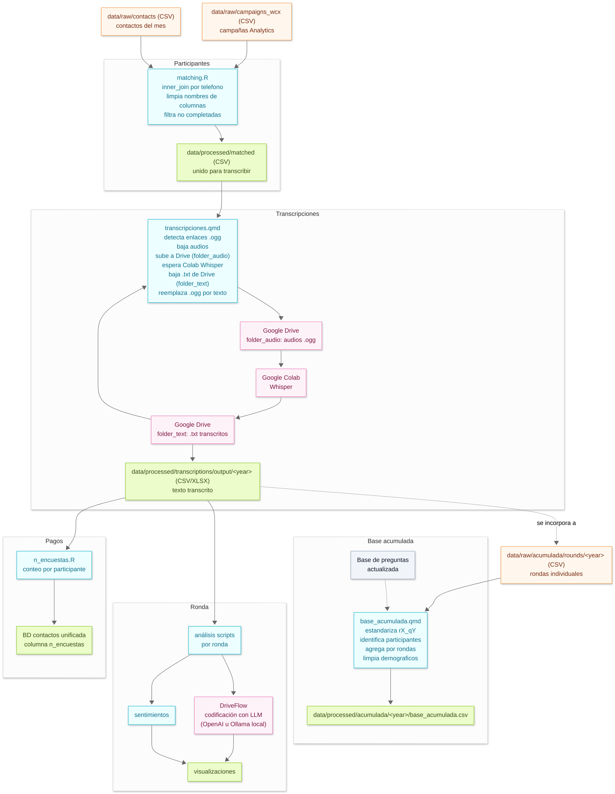

# Flujo de procesamiento de paneles de encuestas


Este repositorio automatiza el ciclo de vida de un **panel de encuestas**: un mismo grupo de personas al que se
vuelve a encuestar mensualmente en rondas rotativas cada tres meses, para poder comparar sus respuestas a
lo largo del tiempo en vez de solo mirar una foto puntual. Ese diseño longitudinal es lo que obliga a buena
parte de las decisiones técnicas del repo: hay que poder identificar a la misma persona entre rondas, mantener
la numeración de preguntas consistente año a año, y dejar trazabilidad de cómo se llegó de una respuesta cruda
a un dato analizable.

Las encuestas se levantan por una plataforma de mensajería que permite respuestas por texto **y por audio**
(un audio de WhatsApp). Eso agrega un paso que no existe en un flujo de encuestas tradicional: antes de poder
analizar nada hay que **transcribir** esos audios a texto.

Una vez que las respuestas son texto, hay dos tipos de preguntas que se tratan distinto:

- **Preguntas cerradas** (opción múltiple): se agregan y grafican directamente.
- **Preguntas abiertas** ("¿por qué?", "¿qué opina de...?"): no se pueden tabular tal cual. Para poder
  analizarlas a escala, cada respuesta se **codifica**, es decir, se le asignan una o más etiquetas de un
  codebook (diccionario de categorías) definido de antemano para esa pregunta. Este repo usa un modelo de
  lenguaje (LLM) para hacer esa codificación de forma consistente y a escala, en vez de que una persona lea y
  clasifique manualmente cientos de respuestas por ronda — con la opción de correrlo contra un modelo en la
  nube (OpenAI) o contra un modelo local (Ollama, por ejemplo Qwen) para no depender de una API externa.

El resultado de todo el flujo son bases de datos limpias, comparables entre rondas y entre años, listas para
análisis cuantitativo (tablas, gráficos) y cualitativo (códigos, sentimiento) por ronda.

## Reusar este flujo para un proyecto nuevo

El código está separado en dos niveles de configuración para poder levantar el mismo flujo en un proyecto
distinto (otra cuenta de Google Drive, otro cliente) sin tocar los scripts:

- **`project.yml`** (raíz del repo): todo lo que es igual para **todo el proyecto** — la cuenta de Drive, las
  carpetas raíz donde se suben/bajan audios, la carpeta con el sheet de preguntas, y los defaults de
  codificación (proveedor de LLM, modelo, tamaño de lote). Es el único archivo que hay que completar de punta
  a punta al arrancar un proyecto nuevo.
- **`DriveFlow/<ronda>.yml`**: lo que cambia **ronda a ronda** — el id de ronda, el año, la carpeta en Drive de
  esa ronda puntual, y los nombres de salida. Usar `DriveFlow/_template.yml` como base para crear una ronda
  nueva.

```yaml
# project.yml (resumen)
project_name: "..."
drive:
  account_email: "..."       # cuenta usada por drive_auth()
  folder_audio: "A"          # carpeta raíz: audios subidos para Whisper
  folder_text: "B"           # carpeta raíz: .txt transcritos
  questions_url: "..."       # carpeta con el sheet "questions"
codificacion:
  provider: "openai"         # o "ollama" para correr un modelo local
  model: "gpt-5-nano"
  chunk_size: 20
```

Checklist para un proyecto nuevo:

1. Completar `project.yml` con la cuenta de Drive y carpetas del proyecto nuevo.
2. En esa Drive, crear la estructura de carpetas que esperan los scripts (`data/raw/...`, y las carpetas
   `A/<ronda>` y `B/<ronda>` para el intercambio con Colab — ver [Convención de carpetas](#convención-de-carpetas-por-año-round-specific)).
3. Cargar el sheet `questions` (metadata de preguntas) en la carpeta indicada por `drive.questions_url`.
4. Por cada ronda: copiar `DriveFlow/_template.yml` a `DriveFlow/<ronda>.yml` y completar `folder_url`.
5. Definir `OPENAI_API_KEY` como variable de entorno (si se usa `provider: openai`), o tener
   [Ollama](https://ollama.com) corriendo local con el modelo descargado (si se usa `provider: ollama`).

## Convención de carpetas por año (round-specific)

Todo lo que sea **específico de una ronda** se organiza bajo una carpeta de año (por ejemplo `2025/`,
`2026/`), manteniendo fuera de esa jerarquía lo que es general del proyecto.

- Código de análisis por ronda: `code/analysis/<year>/<round_id>/`
- Rondas crudas para acumulada: `data/raw/acumulada/rounds/<year>/`
- Transcripciones crudas (audios/textos): `data/raw/transcriptions/<year>/<round_id>/voice` y
  `data/raw/transcriptions/<year>/<round_id>/text`
- Transcripciones procesadas: `data/processed/transcriptions/output/<year>/`
- Outputs de análisis por ronda: `data/processed/analysis/<year>/<round_id>/`
- Plots por ronda: `plots/<year>/<round_id>/`
- Los outputs persistentes del flujo viven en `data/processed/` o `plots/`; la carpeta raíz `output/` no forma
  parte de la estructura oficial del repo.
- En Google Drive: las carpetas raíz definidas en `project.yml` (`drive.folder_audio` / `drive.folder_text`,
  por defecto `A/` y `B/`) contienen una subcarpeta por `round_id`.

## Procesamiento

### 1. `matching.R` — Unión de encuesta y contactos

**Por qué existe:** los datos que exporta la plataforma de encuestas solo tienen el teléfono como
identificador. Para poder analizar por segmento (edad, género, departamento, etc.) y para poder identificar a
la misma persona entre rondas, hace falta cruzar cada respuesta con la ficha de contacto de esa persona.

- **Propósito:** primer paso del flujo. Toma los datos brutos de una campaña específica y los cruza con la
  información demográfica de los participantes.
- **Input:**
  - Un CSV de una campaña desde `data/raw/campaigns_wcx/`.
  - Un CSV con la lista de contactos del mes desde `data/raw/contacts/`.
- **Qué hace:**
  - `inner_join` entre campaña y contactos usando el número de teléfono como identificador común.
  - Limpia los nombres de las columnas para que sean consistentes entre rondas.
  - Filtra los casos que no terminaron la encuesta.
- **Output:** un CSV "unido" en `data/processed/matched/`, listo para transcribir.

### 2. `transcripciones.qmd` — Flujo de transcripciones

**Por qué existe:** las respuestas de audio no son analizables ni codificables tal cual — primero tienen que
convertirse en texto. Este notebook automatiza el ida-y-vuelta con un Google Colab que corre Whisper (modelo
de transcripción de audio), porque ese paso de transcripción en sí no corre en este repo.

- **Propósito:** gestionar de forma automatizada el proceso de transcripción de las respuestas de audio (.ogg).
- **Input:** el CSV unido generado por `matching.R` desde `data/processed/matched/`.
- **Qué hace:**
  - Detecta todas las celdas del CSV que contienen un enlace a un audio `.ogg`.
  - Descarga cada audio y lo guarda localmente.
  - Sube los audios a la carpeta raíz de audio en Drive (`drive.folder_audio` en `project.yml`).
  - Se espera que se corra el Colab que transcribe los audios con Whisper.
  - Descarga los `.txt` resultantes desde la carpeta raíz de texto en Drive (`drive.folder_text`).
  - Reemplaza los enlaces `.ogg` originales en el CSV por el texto de las transcripciones.
- **Output:** un CSV y un XLSX en `data/processed/transcriptions/output/<year>/`, idénticos al de entrada pero
  con las respuestas de audio ya transcritas a texto.

### 3. `base_acumulada.qmd` — Creación de la base acumulada

**Por qué existe:** cada ronda por separado solo permite ver una foto puntual. Para poder comparar cómo
cambia la opinión de una misma persona (o de un segmento) a lo largo del año, hace falta una base donde cada
fila sea una persona y las columnas acumulen sus respuestas de todas las rondas del año — de ahí que sea
fundamental mantener actualizada la base de preguntas para poder hacer ese cruce cuando haga falta.

- **Propósito:** generar una base acumulada anual que permite análisis longitudinales.
- **Input:** todos los CSV de las rondas individuales desde `data/raw/acumulada/rounds/<year>/`.
- **Qué hace:**
  - Estandarización de columnas: renombra las preguntas de cada ronda para que sean únicas
    (ej. `q1` de la ronda 7 pasa a `r7_q1`).
  - Identificación de participantes: arma una lista de participantes usando la información de contacto más
    reciente disponible para cada persona.
  - Agregación: une la información de los participantes con sus respuestas a lo largo de todas las rondas.
  - Limpieza final: estandariza los valores de columnas demográficas, cuyo formato cambia entre rondas.
- **Output:** `base_acumulada.csv` en `data/processed/acumulada/<year>/`.

### 4. `DriveFlow/` — Codificación de preguntas abiertas con LLM

**Por qué existe:** una pregunta abierta como "¿por qué aprueba/desaprueba la gestión?" puede tener cientos de
respuestas distintas en texto libre. Para poder graficarlas y compararlas entre rondas hace falta reducirlas a
un set fijo de categorías (el codebook). Hacerlo a mano no escala ronda tras ronda; este flujo se lo delega a
un LLM, que lee cada respuesta junto con el codebook de esa pregunta y devuelve los códigos que correspondan,
en formato estructurado (JSON validado contra las categorías del codebook, nunca categorías inventadas).

- **Propósito:** clasificar automáticamente las respuestas abiertas de una ronda contra su codebook.
- **Input:**
  - El CSV de transcripciones de la ronda (`transcripcion_<round_id>`).
  - El sheet `questions` (metadata: qué preguntas son abiertas, de qué dependen, categorías de la pregunta
    cerrada asociada).
  - El codebook de esa ronda (`Book<round_id>`): las categorías válidas por pregunta y su descripción.
- **Qué hace:**
  - Arma un prompt por pregunta con las instrucciones de codificación y las categorías del codebook.
  - Envía cada respuesta (en lotes de `chunk_size`) a un modelo de lenguaje, que devuelve hasta 3 códigos por
    respuesta, ordenados por relevancia.
  - El modelo se elige vía `project.yml`/`DriveFlow/<ronda>.yml`: `provider: openai` usa la API de OpenAI
    (requiere `OPENAI_API_KEY`); `provider: ollama` usa un modelo corriendo local con
    [Ollama](https://ollama.com) (por ejemplo Qwen), sin depender de un servicio externo.
- **Output:** el CSV de la ronda con una columna `codigo_<pregunta>` agregada por cada pregunta abierta, más
  una muestra del 20% para control de calidad, subidos a Drive y exportados a `data/processed/analysis/`.

### 5. `code/analysis/<year>/<round_id>/` — Análisis por ronda

**Por qué existe:** una vez que las respuestas cerradas están tabuladas y las abiertas codificadas, cada ronda
tiene sus propios cortes de interés (comparar por segmento, por pregunta, análisis de sentimiento sobre el
texto de las respuestas, gráficos específicos del tema de esa ronda). Por eso este código vive por ronda y no
es un script único genérico.

- **Output:** gráficos y tablas en `plots/<year>/<round_id>/` y `data/processed/analysis/<year>/<round_id>/`.

### 6. `n_encuestas.R` — Conteo de encuestas contestadas por participante

**Por qué existe:** a los participantes del panel se les paga por ronda contestada, con un piso mínimo de
rondas. Se necesita un conteo confiable de cuántas encuestas completó cada persona en el período de pago.

- **Qué hace:** lee los archivos de transcripciones de un rango de rondas, cuenta encuestas por participante,
  cruza con la base de contactos más reciente y exporta quiénes superan el mínimo para cobrar (y quiénes
  faltan matchear). Se corre una vez al mes para el pago.

## Diagrama



## Requisitos

- R con los paquetes: `tidyverse`, `readr`, `readxl`, `dplyr`, `purrr`, `glue`, `yaml`, `googledrive`,
  `googlesheets4`, `ellmer` (clasificación con LLM), `openxlsx`/`writexl` (exportar XLSX).
- Cuenta de Google autenticada (`drive_auth()` / `gs4_auth()`) con acceso a las carpetas definidas en
  `project.yml`.
- Para codificación con OpenAI: variable de entorno `OPENAI_API_KEY`.
- Para codificación con un modelo local: [Ollama](https://ollama.com) instalado y corriendo (`ollama serve`),
  con el modelo descargado (ej. `ollama pull qwen2.5:14b`).
